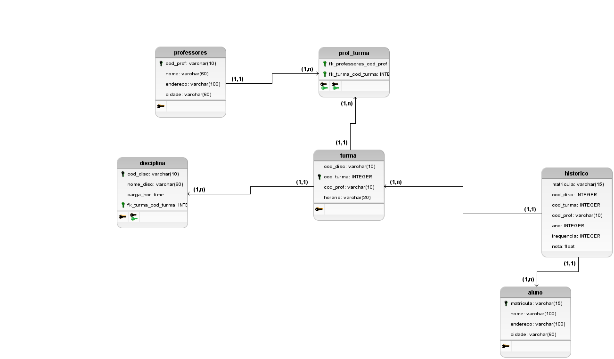
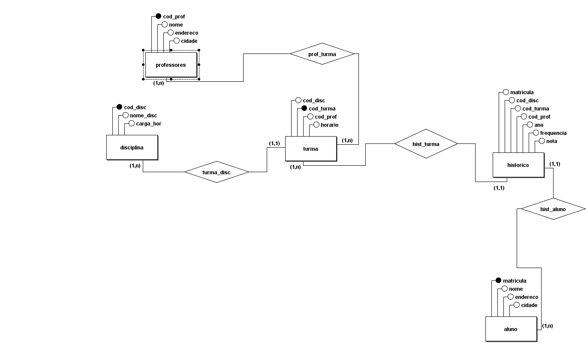

# provaDB

Integrantes do Grupo:

- Matheus Shaddai
- Lunna

Professor: 

- Adeilson

## Modelo lógico 

## Modelo conceitual

## Tabelas

### Tabela _disciplina_

A função da tabela _disciplina_ é armazenar as disciplinas que aluno atribuído irá possuir.  Nela possuímos os atributos/colunas:
- cod_disc : Chave primária da tabela
- nome_disc : Nome das disciplinas
- carga_hor : Carga horária de cada disciplina
- fk_turma_cod_turma : Chave estrangeira 

### Tabela _professores_

A função da tabela _professores_ é armazenar os professores que irão ter turmas. Nela possuímos os atributos/colunas:

- cod_prof : chave primária do professor
- nome : nome do professor
- endereço : endereço do professor
- cidade : informação referente ao professor e onde localiza sua residência

### Tabela _turma_

A função da tabela _turma_ é referente as _disciplinas_ e _professores_ que foram atribuídas a ela. Nesssa tabela possuímos os atributos/colounas:

-cod_turma : Chave primária da tabela
-cod_disc : Chave estrangeira da tabela
-cod_prof : Chave estrangeira da tabela
-horário : Horário em que cada turma irá ter

### Tabela _prof_turma_

A função da tabela _prof_turma_ é fazer ligação entre _professor_ e _turma_. Nela possuímos os atributos/colunas:

-fk_professores_cod_prof : Chave estrangeira que faz referência com a tabela _professor(cod_prof)_
-fk_turma_cod_turma : Chave estrangeira que faz referência com a tabela _turma(cod_turma)_

### Tabela _historico_

A função da tabela _historico_ refere-se a todas as outras tabelas tornando suas chaves primárias para chaves estrangeiras. Nelas possuímos os atributos/colunas:

-matricula : Chave estrangeira
-cod_disc : Chave estrangeira
-cod_turma : Chave estrangeira
-cod_prof : Chave estrangeira
-ano : ano da tabela historico
-nota : Chave estrangeira 
-frequência : Chave estrangeira

### Tabela _aluno_

A função da tabela _aluno_ refere-se aos dados dos alunos cadastrados na escola. Nela possuímos os atributos/colunas:

-matricula : Matricula do aluno/Chave primária da tabela
-nome : 
